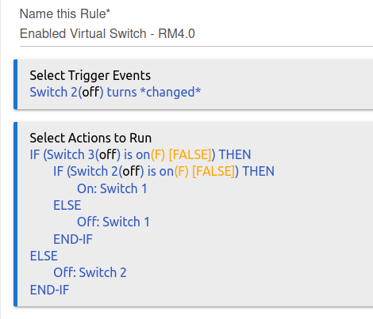

# Virtual Switch Enabler

Turn a switch on/off only when enabled.

> **Note:** This is an upgrade to v2.x. Remove v1.x before installing.

## Description

Virtual Switch Enabler (VSE) is a small application, which allows a device, group, or scene to be controlled, and enabled/disabled by a second switch. VSE was written to facilitate enabling/disabling holiday groups and scenes during the appropriate seasons, to avoid the need to seasonally delete and recreate rules.

This is an easy rule to implement via Rule Manager, as seen here:

However, I rewrote it in Groovy both as an exercise in writing an app for Hubitat and for convenience in creating additional instances.

## Usage

To create an VSE instance:

  1. Create three switches:
     * **Control Switch:** Switch to be used to turn the group, scene, or device on/off; this switch will usually be used on dashboards, etc.
     * **Enabled Switch:** Switch to be used to enable/disable the group, scene, or device; must be *on* before turning the Control Switch on/off.
     * **Target Switch:** Switch which directly turns the group, scene, or device on/off.

  2. Create VSE instance:
     * If VSE hasn't been installed, install through **Hubitat Package Manager** or directly from source.
     * If VSE hasn't already been added, click "Add App," then add, otherwise select the VSE parent app.
     * Select switches, as prompted.

## Changelog

* v2.0.4 (2021-11-03) - Fix broken license link in package manifest (again).
* v2.0.3 (2021-11-03) - Fix broken package manifest links.
* v2.0.2 (2021-11-03) - Update documentation.
* v2.0.0 (2021-11-03) - Add multi-switch control capability. Breaking change, remove v1.x before installing.
## Credits

VSE is my first application written for Hubitat and wouldn't have been written without being able to use the applications in [Robert Morris'](https://github.com/RMoRobert/Hubitat) repository as an example, especially TimedSwitchHelper.
